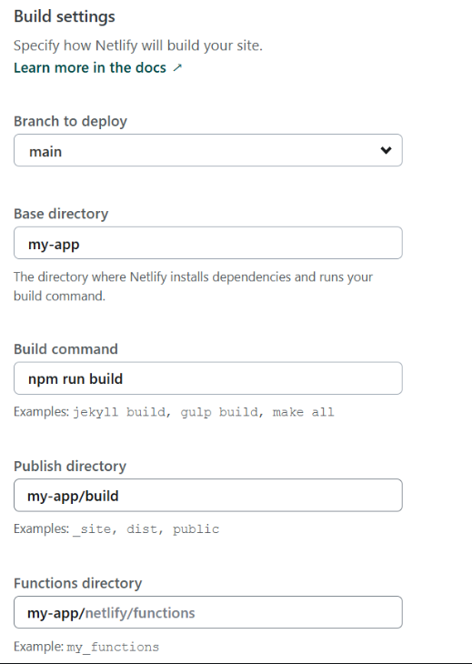
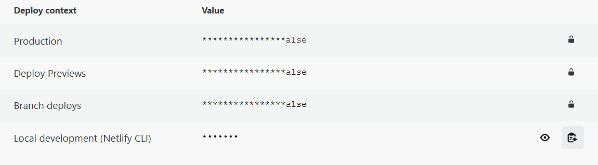

# CaptureCloud

CaptureCloud is a web application developed as part of the CPSC 481 class project. It's designed to streamline the process for photographers to upload, organize, and manage the sales of their photos efficiently.

## Website

[CaptureCloud](https://capturecloud-02.netlify.app/)

For the best viewing experience:
- **Resolution**: Ensure your screen resolution is set to 3024 x 1964.
- **Browser**: Access the website using Google Chrome.
- **Zoom Level**: Set your browser zoom to 90%.

## Meet the Team

- **Caroline Basta**
- **Arushi Gupta**
- **Batool Hussaini Syeda**
- **HyeJu Jung**
- **Shree Patel**

## Features

- **Log In and Create Account Pages**: Secure user authentication system to access personal accounts.
- **Home Page**: A dashboard where users can view all their photos and access other pages.
- **Edit Page**: Allows users to edit photo details and manage albums.
- **Sold Page**: Displays all sold photos with filtering options for better management.
- **Upload Page**: Users can upload photos with detailed tags and descriptions.
- **Album Page**: Organize photos into albums for better categorization.
- **Statistics Page**: Provides insights into sales trends, most popular tags, etc.
- **Trash Page**: Manage deleted photos with options to restore.
- **Account Page**: For user profile and account settings management.

## Technology Stack

- **React**: A JavaScript library for building user interfaces.
- **Tailwind CSS**: A utility-first CSS framework for rapidly building custom designs.
- **Other Technologies**: Various other libraries and APIs as required for specific features.

## Setup and Installation

1. **Clone the repository**:
https://github.com/CarolineBasta/CaptureCloud.git

2. **Navigate to the project directory**:

        cd capturecloud
        
        cd my-app

3. **Install dependencies**:

        npm install

4. **Run the application**:

        npm start

## Pre-existing Account

To explore the full features of CaptureCloud without creating a new account, you can log in using the pre-existing account:

- **Username**: janedoe@gmail.com
- **Password**: Fox245.
- **2-Factor Auth Pin**: 5748332

Users can search for photos in Home Page by typing keywords such as "roses and pink" for pink roses. Additionally, users can click on specific tags like "animal" on the list or All Tag page to filter photos accordingly.

Users can search for photos in Sold Page by typing "Paris" for photos of Paris. Additionally, users can click on specific tags like "sky" on the list or All Tag page to filter photos accordingly.

## Deployment Instructions for Netlify

1. **Sign in to Netlify**  
   Log in using your GitHub account and authorize access to GitHub if prompted.

2. **Fork the Repository**  
   Navigate to the **CaptureCloud** repository on GitHub and click the **Fork** button at the top-right corner to create a copy in your account.

3. **Create a New Site on Netlify**  
   - Return to Netlify and select **Add a New Site** from the dropdown menu.  
   - Choose **Import an Existing Project** from the options provided.

4. **Connect to GitHub**  
   - Select GitHub as the provider and authorize access if required.  
   - On the next screen, locate and select your forked **CaptureCloud** repository.

5. **Configure and Deploy**  
   - On the **Configure and Deploy** page, your GitHub username will automatically appear as the team name.  
   - Enter a custom site name of your choice.  
   - In the **Build Settings** section, input the required fields exactly as shown in the image below:  
     

6. **Set Environment Variables**  
   - Under the environment variables section, create a key named `CI` and set its value to `false`.  
   - Repeat this for additional variables as shown in the image below:  
     

7. **Deploy the Site**  
   Click **Deploy Website** to initiate the deployment process.

---

Once the deployment is complete, your CaptureCloud site will be live and ready for use!

## Acknowledgements

- CPSC 481 - Human-Computer Interaction
- All team members and contributors who have invested time and effort in this project.